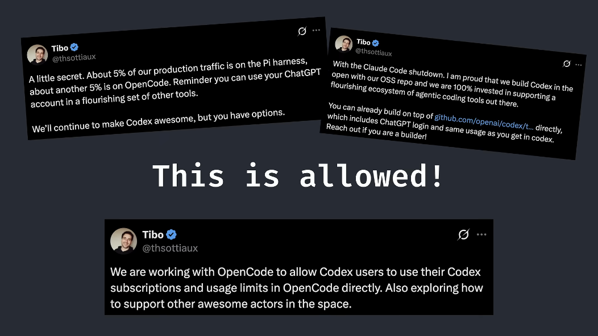
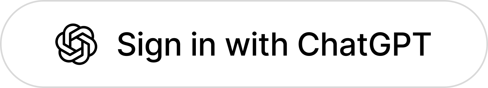
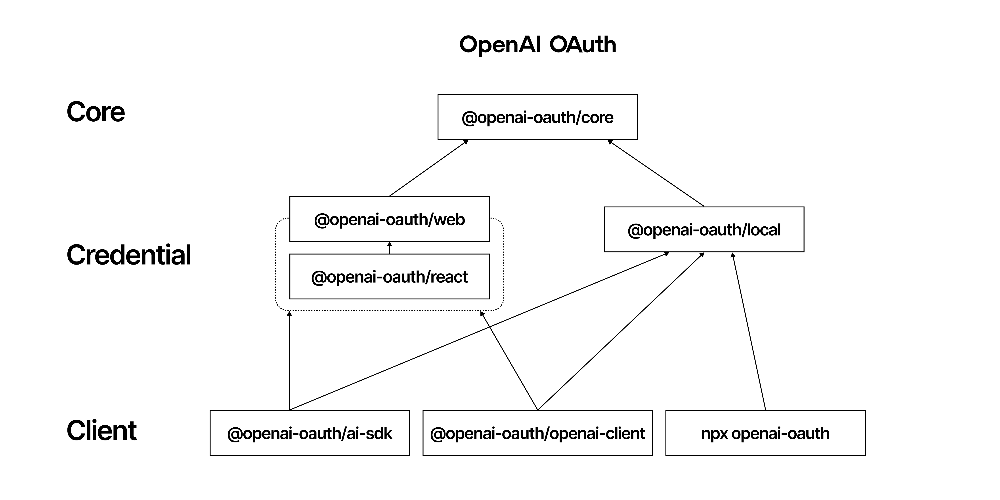

<p align="center">
  
</p>

# Anti-Cheat Bypass

Tampermonkey userscript for [skillrack.com](https://skillrack.com). Kills tab-switch detection, restores copy/paste clipboard, bypasses proctoring telemetry, auto-solves captchas, and generates complete AI solutions using your free ChatGPT account or 9+ AI providers.

**Version:** `5.1a` · **Matches:** `https://*.skillrack.com/*`, `https://skillrack.com/*`

> [!IMPORTANT]
> ⚠️ **CRITICAL DISCLAIMER & WARNING:**
>
> - **Educational Purpose Only**: This project is strictly for research and educational purposes. We take absolutely no responsibility for any actions you take, academic penalties you receive, or account bans you experience. You agree to use this entirely at your own risk.
> - **Account Ban Risk**: Accessing private Codex endpoints directly violates OpenAI's terms of service. **OpenAI can and will ban your account if they detect unauthorized automated usage.**
> - **USE A SECONDARY CHATGPT ACCOUNT**: Do **NOT** use your primary personal, academic, or work account. Create a secondary throwaway account to use with this script.
> - **Bypass Disclaimer**: Bypassing anti-cheat systems violates SkillRack's Terms of Use and your institution's academic honor codes.
>
> **Reverse-Engineering & Open-Source Context**: 
> OpenAI's official Codex CLI client is open-sourced under the Apache-2.0 License. [Thibault "Tibo" Sottiaux](https://x.com/thsottiaux) (Product Lead on the OpenAI Codex team) has publicly confirmed that users are allowed to use their accounts in custom or alternate agentic harnesses built on top of the open [Codex](https://github.com/openai/codex) repository. 
> 
> Specifically, following competitor harness restrictions in January 2026, Sottiaux [stated on X](https://x.com/thsottiaux/status/2009714843587342393) that OpenAI is *"100% invested in supporting a flourishing ecosystem of agentic coding tools"* and confirmed builders can build on the Codex repo directly. Sottiaux later [confirmed](https://x.com/thsottiaux/status/2009742187484065881) that they are actively working to allow Codex users to use their subscriptions in alternative harnesses like OpenCode directly. In May 2026, Sottiaux [shared](https://x.com/thsottiaux/status/2058071172361998482) that ~10% of their production traffic runs on third-party developer harnesses (like the Pi harness and OpenCode). We reverse-engineered the OAuth handshake (which listens on port `1455` for login callback parameters) and client endpoints directly from the open source codebase to build a local API bridge. However, utilizing this bridge to automate academic platforms or bypass proctored checks is unauthorized.
>
> <p align="center">
>   
> </p>

---

## What it does

| Feature | How |
|---------|-----|
| Tab switch detection | Spoofs `document.visibilityState` → always `visible` |
| Copy / paste / cut | Intercepts clipboard events before jQuery handlers run |
| Fullscreen enforcement | Intercepts `requestFullscreen()`, spoofs `fullscreenElement` |
| Multi-monitor detection | Spoofs `screen.left`, `screen.top`, `screen.isExtended` |
| Heartbeat / telemetry | Blocks XHR + Fetch to proctoring endpoints, returns fake 200s |
| ACE editor restrictions | Blocks `bte` command registration, overrides `cs()` diff check |
| Drag & drop | Strips `ondragstart`/`ondrop`/`onselectstart` from all elements |
| Captcha | Tesseract.js OCR on the math captcha image (auto-retry on fail) |
| AI solution | Generates code using one of 9+ providers, fills the ACE editor |
| Auto Solver | Fully automated: captcha → AI → run → next problem |
| Human typing simulation | Press `Q` to toggle instant insert ↔ variable char-by-char delay |
| Popup neutralization | Intercepts `window.alert`/`confirm`, renders non-blocking toast pills |
| Session keep-alive | Silent `HEAD` request loop every 2.5 min prevents timeout |
| WASD hotkeys | Ghost UI toggles, code inspection, manual AI triggers |

---

## AI Providers Supported

| Provider | Cost | Authentication & Details |
|---|---|---|
| **ChatGPT (openai-oauth)** | Free | Browser OAuth session (no API key required). Uses `chatgpt.com/backend-api/codex` directly. |
| **DuckDuckGo AI** | Free | Zero setup / account-free endpoint. Available: GPT-4o Mini, GPT-5 Mini, GPT-OSS 120B, Llama 4 Scout, Claude 3.5 Haiku, Mixtral Small 3. |
| **Google Gemini** | Free Tier | API Key via [Google AI Studio](https://aistudio.google.com/app/apikey). Supports Gemini 2.0 Flash, Gemini 2.0 Flash Lite, Gemini 2.5 Pro, and more. |
| **Groq / Llama 3** | Free Tier | API Key via [Groq Console](https://console.groq.com/keys). Fast inference on Llama 3, Mixtral, and other open models. |
| **OpenRouter** | Free + Paid | 300+ models via [OpenRouter](https://openrouter.ai/keys). Fetches models dynamically from API. 6-hour cache. Search by name, filter free-only. Default: `google/gemini-2.0-flash:free`. Fallback: `openrouter/free`. |
| **OmniRouter** | Free + Paid | Multi-provider routing via [OmniRouter](https://omnirouter.ai). Intelligent fallback across multiple AI providers for maximum reliability. |
| **G4F Space** | Free | Account-free proxy endpoint at [g4f.space](https://g4f.space). |
| **OpenAI Direct API** | Paid | Standard OpenAI API Key (`sk-...`). |
| **Local Pre-Solved DB** | Free | Local GitHub/Offline repository solver database. |

## Installation & Setup

1. Install **[Tampermonkey](https://www.tampermonkey.net/)** in your browser (Chrome, Firefox, Edge, Brave).
2. Install the userscript directly from the repository:
   - Click → **[Install Script](https://raw.githubusercontent.com/Vishnu-tppr/skillrack-script/refs/heads/main/Anti-Cheat%20Bypass%205.0.user.js)**
   - Or manually: `Project-KillCode.js` or `userscript.user.js`
3. Open any SkillRack page (`https://www.skillrack.com/*`).
4. Accept the disclaimer on first load (saved in `localStorage`).
5. Click the floating **⚙️ Settings** icon in the bottom-right corner to configure your preferred AI Provider and Bypass options.

The script auto-updates from GitHub (`@updateURL` is set in the header).

---

## Free AI via ChatGPT — No API Key Needed

This is the main reason to use this script. OpenAI charges ~$15/M tokens for API access. ChatGPT accounts get the same compute for free. The script uses your ChatGPT OAuth token to call `chatgpt.com/backend-api/codex` directly — the exact same model, zero cost.

It works in two modes. The script tries Mode 1 first and falls back automatically:

```
Mode 1: GM_xmlhttpRequest → chatgpt.com/backend-api/codex (browser-only)
         ↓ 401 / 403 / network error
Mode 2: http://127.0.0.1:10531/v1 (local npx openai-oauth proxy)
         ↓ proxy not running
Error: "Sign in or start npx openai-oauth"
```

### Setup (Browser-Only, No Terminal)

**Step 1 — Install the "Sign in with ChatGPT" Extension**

This extension intercepts OpenAI's OAuth callback at the browser level. No server required.

- Chrome: [Chrome Web Store](https://chromewebstore.google.com/detail/sign-in-with-chatgpt/odbgboachaefbbbdiffcefhpkekhfcna)
- Firefox: [Firefox Add-ons](https://addons.mozilla.org/firefox/addon/sign-in-with-chatgpt/)
- Or load unpacked from `chrome-extension/` (developer mode)

Host permissions: `http://localhost:1455/*` only. Nothing leaves your device.

**Step 2 — Sign In**

<p align="left">
  
</p>

1. Open SkillRack → click ⚙️ (bottom-right)
2. Set **AI Provider** → **ChatGPT (openai-oauth)**
3. Click **Sign in with ChatGPT**
4. Login at OpenAI's page → extension intercepts the callback → shows "Continue to skillrack.com" → click Continue
5. Token saved in `localStorage` as `oai_oauth_session`

Done. No terminal, no API key.

**Step 3 — (Optional) Local Proxy Fallback**

If the direct call gets blocked (Cloudflare, token expiry, etc.):

```bash
npx openai-oauth@latest
```

Starts OpenAI-compatible endpoint at `127.0.0.1:10531/v1`. Models depend on your ChatGPT plan: `gpt-5.6-terra`, `gpt-5.6-sol`, `gpt-5.5`, `gpt-5.4-mini`, `gpt-image-2`.

Background commands:
```bash
npx openai-oauth --detach    # run in background
npx openai-oauth status
npx openai-oauth logs --follow
npx openai-oauth stop
npx openai-oauth login       # sign in without starting server
```

### How the OAuth Flow Works



```
Script → OAuthLogin.initiateLogin() → PKCE auth URL → auth.openai.com
  ↓
User logs in
  ↓
OpenAI redirects → http://localhost:1455/auth/callback?code=...&state=...
  ↓
Extension (declarativeNetRequest) intercepts → chrome-extension://.../confirm.html
  ↓
User clicks "Continue to skillrack.com"
  ↓
Page reloads with ?code=...&state=...&oo2_cb=1
  ↓
Script exchanges code → https://auth.openai.com/oauth/token via GM_xmlhttpRequest
  ↓
Token stored in localStorage → used as Bearer on chatgpt.com/backend-api/codex
```

## Settings Panel

Click ⚙️ bottom-right. All settings persist in `localStorage`.

### Bypasses
| Setting | Default |
|---------|---------|
| Tab Detection Bypass | ✅ |
| Copy/Paste Bypass | ✅ |
| Fullscreen Bypass | ✅ |
| Multi-Monitor Bypass | ✅ |
| Block Telemetry | ✅ |
| Fullscreen Copy Mode | ❌ |
| Popup Mode | ❌ |

### Editor
| Setting | Default |
|---------|---------|
| Drag & Drop | ✅ |
| Text Selection | ✅ |
| Context Menu | ✅ |
| Human Typing Mode | ❌ (instant insert) |

### Captcha
| Setting | Default |
|---------|---------|
| Auto-Solve Captcha | ✅ |
| Username (for captcha parsing) | empty |

Set username if yours has `+` and numbers — e.g. `abcd123+21@xyz.com`.

### AI
| Setting | Default |
|---------|---------|
| Enable AI Solver | ❌ |
| Include Pre/Post Code | ❌ |
| Provider | Gemini |
| Gemini Model | `gemini-2.5-flash` |
| OpenAI Model | `gpt-5.4-mini` |
| OpenAI Auth Mode | ChatGPT OAuth |
| OpenRouter Model | `qwen/qwen3-coder:free` |
| Puter Model | `gpt-5.4-nano` |
| Puter Reasoning | ❌ |
| G4F Model | `auto` |
| DuckDuckGo Model | `gpt-4o-mini` |
| DuckDuckGo Reasoning | ❌ |
| OmniRoute Gateway | `http://localhost:20128` |

### Auto Solver & Finder
| Setting | Default |
|---------|---------|
| Find Incomplete Questions | ❌ |
| Auto Solver | ❌ |
| Auto-Solver Queue | empty |
| Queue Progress HUD | Enabled while queue is active |

---

## Keyboard Shortcuts

- **`Q`** — Toggle Human Typing Speed Mode ON (natural typing) / OFF (instant insert).
- **`W`** — Toggle Ghost Mode: hides the script UI while keeping it clickable.
- **`A`** — Find incomplete / unsolved questions.
- **`S`** — Stop all automation; press again to re-arm it.
- **`D`** — Trigger AI Solution generation.
- **`Esc`** — Close or minimize the Find Incomplete / Auto-Solver panel.

> WASD hotkeys are ignored while typing in inputs, textareas, Ace, CodeMirror, or other editable fields.

---

## Auto Solver

⚠️ Experimental.

With **AI Solver** + **Auto Solver** both enabled:

1. Waits for captcha to clear
2. Clicks the purple "🤖 AI Solution" button
3. Waits for generation, pastes into editor
4. Clicks Run
5. On success → next problem. On failure → retries (configurable max).

Click **STOP** to halt at any time.

---

## SkillRack Scraper & Local API Bridge (`skillrack-scraper`)

The `skillrack-scraper` module is an asynchronous Python scraper and FastAPI bridge that scans SkillRack for incomplete/unsolved questions across all CODETUTOR language packs (C, Java, Python, C++, SQL, DS-C, DS-Java) and CODETRACK levels (2–6, 100/Prime). It exposes a local HTTP API consumed by the `Project-KillCode.js` Tampermonkey userscript to drive automated question discovery.

### Key Features
- **Cookie Authentication**: Reads session cookies from `cookie.txt` or `SKILLRACK_COOKIE` environment variable with automatic token merging.
- **Resilient Scraping**: Implements PrimeFaces ViewState progression, automatic exponential backoff, configurable request delay pacing, and graceful error recovery.
- **Language Normalization**: Maps raw SkillRack tags to standard language target strings (`CPP23`, `PYTHON311`, `C17`, `JAVA21`, `SQL`, etc.).
- **FastAPI Bridge**: Serves question inventories to `Project-KillCode.js` via CORS-enabled endpoints (`http://127.0.0.1:8000`).
- **Typer CLI**: Command-line interface for running scrapes, starting the local server, viewing statistics, and exporting data.

### JSON Output Schema
```json
[
  {
    "level": "EASY",
    "language": "CPP23",
    "section": "C++ Primer",
    "problem_set": "C++ Programming C++ Primer C++ - S001",
    "question": "C++ Programming C++ Primer CW004 - MFIB - Swap Unit Digits (Id-11374)",
    "link": "https://www.skillrack.com/faces/candidate/codeprogram.xhtml"
  }
]
```

### Local API Endpoints (`http://127.0.0.1:8000`)
| Endpoint | Method | Description |
|---|---|---|
| `/health` | GET | API health check and status verification. |
| `/questions` | GET | Returns filterable list of scraped unsolved questions (`language`, `level`, `section`, `limit`, `offset`). |
| `/scrape` | POST | Initiates asynchronous background scraping job (returns `job_id`). |
| `/scrape/{job_id}` | GET | Polls status and progress percentage of a background scrape job. |
| `/scrape/sync` | POST | Runs scrape operation synchronously and returns results immediately. |
| `/cookie` | POST | Updates active session cookie in `cookie.txt` directly from browser/Tampermonkey. |
| `/cookie/status` | GET | Checks `cookie.txt` presence and previews active session snippet. |
| `/stats` | GET | Returns metrics summary (total questions found, packs/levels scanned, duration, errors). |

### CLI Commands
```bash
# Run full scrape and output results to JSON
python -m skillrack_scraper scrape -o results.json

# Run scrape and generate interactive dark-theme HTML report
python -m skillrack_scraper scrape --html report.html

# Start local FastAPI bridge server for Tampermonkey userscript
python -m skillrack_scraper serve --port 8000

# Export scraped JSON to CSV, JSONL, or HTML format
python -m skillrack_scraper export results.json output.csv --format csv
python -m skillrack_scraper export results.json output.html --format html

# View statistics or list available packs & levels
python -m skillrack_scraper stats -f results.json
python -m skillrack_scraper list-packs
python -m skillrack_scraper list-levels
```

---

## Offline Solving Toolkit (`tools/`)

The `tools/` folder provides a suite of standalone Python utilities for manual problem enumeration, statement/sample fetching, solution batching, offline test verification, and progress tracking.

### Utility Reference
| Script | Description |
|---|---|
| `sack.py` | Shared HTTP client core handling session cookie authorization (`cookie.txt` / `$SKILLRACK_COOKIE`) and ViewState tracking. |
| `enum.py` | Enumerates unsolved problem IDs for CODETUTOR packs (`0..6`) or CODETRACK levels (`--lev 2..6/100`). |
| `fetch.py` | Scrapes problem statements and sample input/output test cases for enumerated CODETUTOR IDs. |
| `fetchlev.py` | Scrapes problem statements and sample test cases for CODETRACK level problem IDs. |
| `verify.py` | Compiles and evaluates local solution markdown files (`solutions/<id>.md`) against recorded sample test cases. |
| `compile.py` | Language-aware compilation and execution tool (C, C++, Java, Python). |
| `mkbatch.py` | Splits enumerated problem statements into parallel batch files for solver pipelines. |
| `status.py` | Solved vs. pending inventory tracker with breakdown per language and automatic `document.md` generator. |

### Typical Workflow
```bash
# 1. Enumerate unsolved C problems
python3 tools/enum.py 0 --json /tmp/sack_c_enum.json

# 2. Fetch statements and sample test cases
python3 tools/fetch.py /tmp/sack_c_enum.json 0 --out /tmp/sack_c_stmts.json

# 3. Create parallel solver batches
python3 tools/mkbatch.py /tmp/sack_c_stmts.json --n 8 --outdir /tmp/sack_batches

# 4. Verify local solution file against sample I/O
python3 tools/verify.py solutions/6650.md /tmp/sack_c_stmts.json

# 5. Check progress and regenerate tracking documentation
python3 tools/status.py /tmp/sack_c_stmts.json
python3 tools/status.py --md document.md
```
---

### Cookie input

The `scrape` command accepts `--cookie` as either a raw cookie string or a path to a local `cookie.txt` (see [Cookie setup](#cookie-setup) above). Never commit a real cookie file.

---

## Cookie setup

1. Copy `cookie.example.txt` to `cookie.txt`.
2. Replace every `YOUR_..._HERE` placeholder with your own current cookie values.
3. Keep `cookie.txt` private; it is ignored by Git and must never be committed.

For Bash:
```bash
cp cookie.example.txt cookie.txt
```
For Windows PowerShell:
```ps
Copy-Item cookie.example.txt cookie.txt
```
---

## Captcha Solver

Uses Tesseract.js (loaded via `@require`). Inverts the captcha image for better OCR accuracy. Detects the captcha image dynamically — works across different SkillRack page layouts.

First run takes a few seconds while Tesseract initialises. Subsequent runs are fast.

---

## ACE Editor Bypass Details

SkillRack uses multiple layers to block copy/paste in the code editor:

| What SkillRack does | What the script does |
|---------------------|----------------------|
| `commands.addCommand({name:'bte', bindKey:'ctrl-c\|ctrl-v\|...'})` | Blocks `addCommand` calls with key `bte` |
| `commands.on("exec", ...)` paste block | Drops exec handlers that reference paste |
| `container.addEventListener("drop", ...)` | Adds working drop handler at capture phase |
| Anti-bulk-paste (resets editor if 30+ chars pasted) | Intercepts `setValue()` and change handlers |
| `cs()` diff check | Overrides to always sync code |

The script intercepts `ace.edit()` before SkillRack's code runs (`@run-at document-start`), so all of this happens before restrictions are applied.

---

## MFIB — Multiple Fill In the Blank

Some SkillRack problems have multiple inline blanks (`[BLANK_0]`, `[BLANK_1]`, ...) mixed with static code.

The script:
1. Parses the template, identifies each blank
2. Sends a structured JSON prompt to the AI
3. Parses the JSON array response
4. Fills each input field with proper browser events (so the React/Angular framework registers the change)

---

## Troubleshooting

**Clipboard still blocked**
Check console for "Blocked" — means a jQuery handler ran before the script. Confirm `@run-at document-start` is set in Tampermonkey's script settings.

**ACE editor blank / `getSession is not a function`**
Usually means the editor loaded before the interception. Try force-refreshing (Ctrl+Shift+R).

**Captcha not solving**
Wait 3-5 seconds on first run (Tesseract download). If it loops, close and reopen the tab.

**ChatGPT provider not working**
- Extension not installed? → [Chrome](https://chromewebstore.google.com/detail/sign-in-with-chatgpt/odbgboachaefbbbdiffcefhpkekhfcna) / [Firefox](https://addons.mozilla.org/firefox/addon/sign-in-with-chatgpt/)
- Token expired? → re-sign in from Settings
- Getting 403? → OpenAI may have patched the endpoint. [File an issue](https://github.com/Vishnu-tppr/Project-KillCode/issues).
- Still blocked? → run `npx openai-oauth@latest` as proxy fallback

**OpenRouter models not loading**
Click the 🔄 button in the model selector. Models cache for 6 hours.

---

## Disclaimer

This script is provided as-is. Using it may violate SkillRack's terms of service and your institution's academic integrity policies. You are responsible for how you use it.

The ChatGPT integration uses [openai-oauth](https://github.com/EvanZhouDev/openai-oauth), an unofficial community project. It is not affiliated with or endorsed by OpenAI. You must comply with OpenAI's [Terms of Use](https://openai.com/policies/terms-of-use/).

**Disable this script during actual tests.**

---

## Credits

- **[ToonTamilIndia](https://github.com/ToonTamilIndia)** — main development
- **[adithyagenie](https://github.com/adithyagenie/skillrack-captcha-solver)** — captcha solver
- **[EvanZhouDev/openai-oauth](https://github.com/EvanZhouDev/openai-oauth)** — openai-oauth SDK (Apache-2.0)
- **[Vishnu-tppr](https://github.com/Vishnu-tppr)** — ChatGPT integration & reverse engineering

---

## License

MIT License. Educational and Research Use Only.